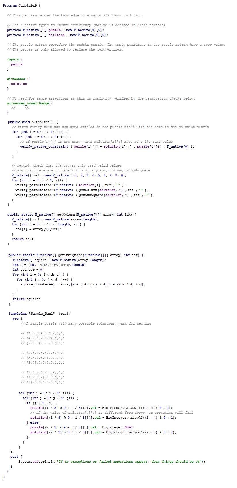
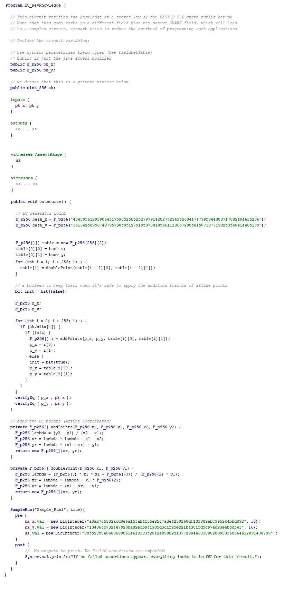
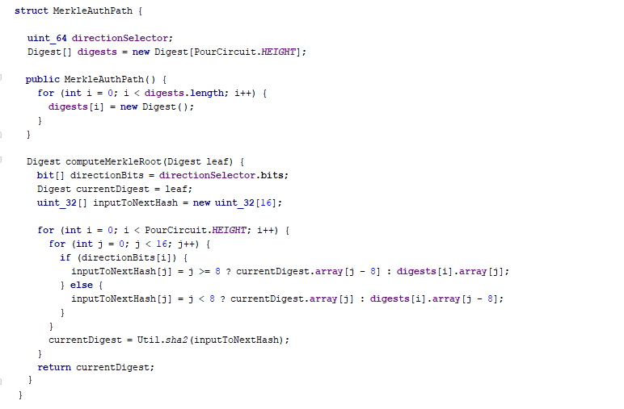

# Code Previews

For illustration purposes, this file includes snapshots from the examples currently implemented in the framework. The ``sample_generated_intermediate_code`` directory shows examples of the intermediate java files that xJsnark generates after processing the code below.

# Examples
- [Sudoku 9x9](https://github.com/akosba/xjsnark/tree/master/code_previews#sudoku-9x9)
- [SHA-256 (Unpadded)](https://github.com/akosba/xjsnark/tree/master/code_previews/README.md#sha-256-unpadded)
- [RSA Secret Key Knowledge](https://github.com/akosba/xjsnark/tree/master/code_previews/README.md#rsa-secret-key-knowledge)
- [EC Secret Key Knowledge](https://github.com/akosba/xjsnark/tree/master/code_previews/README.md#ec-secret-key-knowledge)
- [AES 128](https://github.com/akosba/xjsnark/tree/master/code_previews/README.md#aes-128)
- [Sorting](https://github.com/akosba/xjsnark/tree/master/code_previews/README.md#sorting)
- [ZeroCash Pour Circuit](https://github.com/akosba/xjsnark/tree/master/code_previews/README.md#zerocash-pour-circuit)

## Sudoku 9x9
This example illustrates the usage of native finite field types/constraints and builti-in permutation verification to build a zk-SNARK circuit that proves the knowledge of a valid Sudoku solution.

## SHA-256 (Unpadded)
This is a high-level code for SHA-256. Compared to manually-developed circuit in low-level libraries such as libsnark gadget libraries or [jsnark](https://github.com/akosba/jsnark/blob/d12b6d93a0ec1760ffe34b7f36e4fb4d8562ca93/JsnarkCircuitBuilder/src/examples/gadgets/hash/SHA256Gadget.java), in which the programmer has to take care of the range of the variables, and write optimizations for maj and ch computations, xJsnark aims to produce optimized circuits from the high-level code, whenever possible. The back end applies several techniques to minimize the number of constraints which leads to an optimized implementation.

## RSA Secret Key Knowledge
This example illustrates the support for long integer types and operations by xJsnark.

## EC Secret Key Knowledge
This example illustrates the parameterized field types that can be defined by the user. Even, if the circuit operates in a non-native zk-SNARK field, the complexity of the code does not change. These field types are not only for making programming easier, but also the back end utilizes these information to make much better decisions.
### Field Definition

### EC Secret Key Knowledge Circuit

## AES 128
This example applies an improved technique for S-Box implementation in the back end. To use random access memories in xJsnark, where the index accessed is a circuit variable, the programmer can use the RAM type. Internally, the back end explores the different techniques available for representing the memory accesses and chooses the most efficient implementation based on the workload and several other factors (more optimizations will be added to the memory implementation in the future).

## Sorting
 This example illustrates how to use the external code blocks for non-determinism (setting the values of the external witnesses provided by the prover), and the usage of the permutation verification native instruction which could enable writing more optimized circuits for some applications, like sorting, or pointer chasing.

## ZeroCash Pour Circuit
High-level implementation of the Pour circuit in the [ZeroCash](http://zerocash-project.org/media/pdf/zerocash-extended-20140518.pdf) paper, that results into an optimized circuit similar to the manually-optimized circuit.High-level implementation of the Pour circuit in the [ZeroCash](http://zerocash-project.org/media/pdf/zerocash-extended-20140518.pdf) paper, that results into an optimized circuit similar to the manually-optimized circuit. 
### Helper Classes
These are structures that are used within the Pour circuit. Each structure can only have xJsnark types, and can have methods. However, inheritance and polymorphism are not supported for xJsnark's structs.
#### Coin Information

#### Merkle Authentication Path

#### Keys

#### Digest

### Pour Circuit

